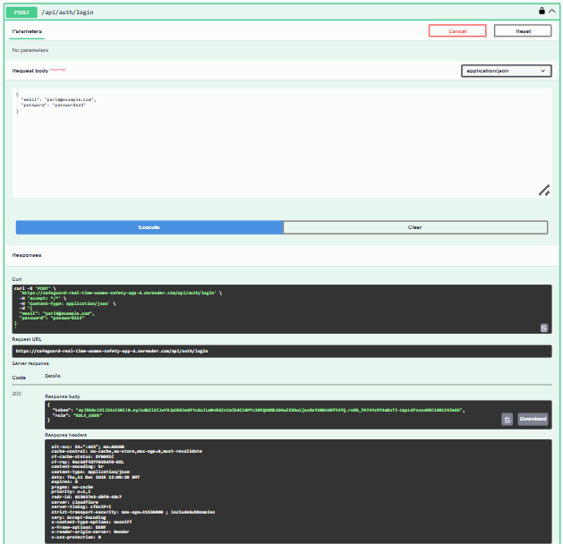
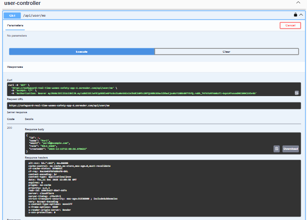
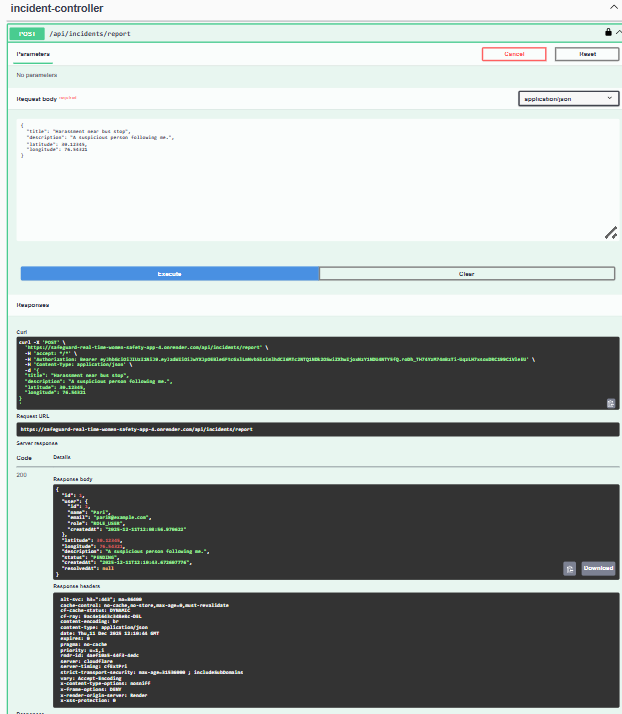
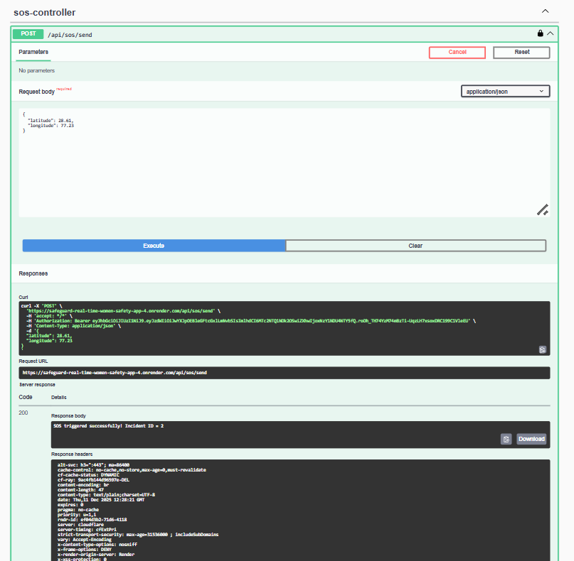
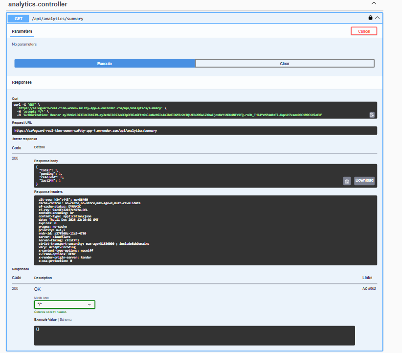

# 🚨 Safeguard – Real-Time Women Safety System  
**Production-grade backend for emergency SOS alerts, incident reporting, and safety analytics.**  
Built with **Java Spring Boot**, **JWT Security**, **MySQL**, **Docker**, and deployed on **Render Cloud**.

---

## 📌 Live Demo  
🌐 **Swagger UI (Public API Testing):**  
👉 https://safeguard-real-time-women-safety-app-4.onrender.com/swagger-ui/index.html

📁 **GitHub Repository:**  
👉 https://github.com/pari8430/Safeguard-real-time-women-safety-App

---

# 🛡️ Overview  
Safeguard is a **real-time women safety backend** designed for emergency response applications.  
It provides:

- One-tap **SOS alerts**
- Incident reporting with geolocation
- JWT-secured user authentication
- Analytics for incident frequency tracking
- Fully containerized production deployment

This backend can support mobile apps, dashboards, or IoT devices.

---

# 🚀 Features

### 🔐 Authentication
- JWT-based login & registration  
- Stateless Spring Security (v6)  
- User identity extraction middleware  

### 📍 Incident Management
- Report incidents  
- Fetch user-specific incident history  
- Get recent public incidents (dashboard-ready)  

### 🆘 SOS Module
- One-tap SOS trigger  
- Automatically logs an incident with timestamp  
- Ready for real-time alerting extensions  

### 📊 Analytics
- Incident counts  
- Daily summary metrics  
- API-ready for dashboards  

### 📘 Interactive API Docs
- Full OpenAPI (Swagger) integration  
- Test endpoints from UI  

---

# 🧱 Tech Stack

| Layer          | Technology |
|----------------|------------|
| Backend        | Java 21, Spring Boot 3 |
| Security       | Spring Security, JWT |
| Database       | MySQL (Railway Managed DB) |
| Documentation  | Swagger / OpenAPI |
| Deployment     | Docker + Render Cloud |
| ORM            | JPA / Hibernate |

---

## System Architecture

flowchart TD
    A[Mobile / Web App] --> B[Spring Boot API (Dockerized)]
    B --> C[Authentication - JWT & RBAC]
    B --> D[Incident Module]
    B --> E[SOS Controller]
    B --> F[CRUD & User Management]
    B --> G[MySQL Database]
    G --> H[Swagger / OpenAPI]

---

# 📚 API Endpoints

## 🔐 Authentication
| Method | Endpoint                | Description |
|--------|--------------------------|-------------|
| POST   | `/api/auth/register`     | Register new user |
| POST   | `/api/auth/login`        | Login & get JWT |

---

## 📍 Incident Reporting
| Method | Endpoint                  | Description |
|--------|----------------------------|-------------|
| POST   | `/api/incidents/report`   | Create new incident |
| GET    | `/api/incidents/my`       | Get incidents for logged-in user |
| GET    | `/api/incidents/recent`   | Fetch recent incidents (public view) |

---

## 🆘 SOS
| Method | Endpoint            | Description |
|--------|----------------------|-------------|
| POST   | `/api/sos/send`     | Trigger emergency SOS |

---

## 📊 Analytics
| Method | Endpoint                    | Description |
|--------|------------------------------|-------------|
| GET    | `/api/analytics/summary`    | Incident statistics |

---

# 🐳 Docker Deployment

### **Build the JAR**
./mvnw clean package -DskipTests

### **Build Docker Image**

docker build -t safeguard-app .

### **Run Container**

docker run -p 8080:8080 safeguard-app

---

# 🛠️ Local Development Setup

### **1. Clone the Repository**

git clone https://github.com/pari8430/Safeguard-real-time-women-safety-App.git

cd Safeguard-real-time-women-safety-App

### **2. Configure MySQL (`application.properties`)**

spring.datasource.url=jdbc:mysql://localhost:3306/safeguard
spring.datasource.username=root
spring.datasource.password=yourpassword

### **3. Run the application**

./mvnw spring-boot:run

Swagger will open at:  
👉 http://localhost:8080/swagger-ui/index.html

---

# 🌐 Deployment (Render Cloud)

This project uses:

- Dockerfile-based deployment  
- Railway-hosted MySQL database  
- Render's auto-build + auto-deploy pipeline  
- Environment variables + secure configs  

---

# 📸 Screenshots  

- Swagger UI homepage  

.
. 
- Authentication endpoints
  
.
- User Analytics

.
- Incident Endpoints

.
- Sos endpoint
  
.
- Analytics Summary

---

# 📝 Future Enhancements

- WebSocket real-time alerts  
- Mobile app integration  
- Admin portal (React)  
- Geo-fencing & heatmaps  
- SMS/WhatsApp notifications  

---

# 👤 Author

**Pari Singh**  
Backend Developer | Java + Spring Boot | Cloud Deployments  
GitHub: https://github.com/pari8430
